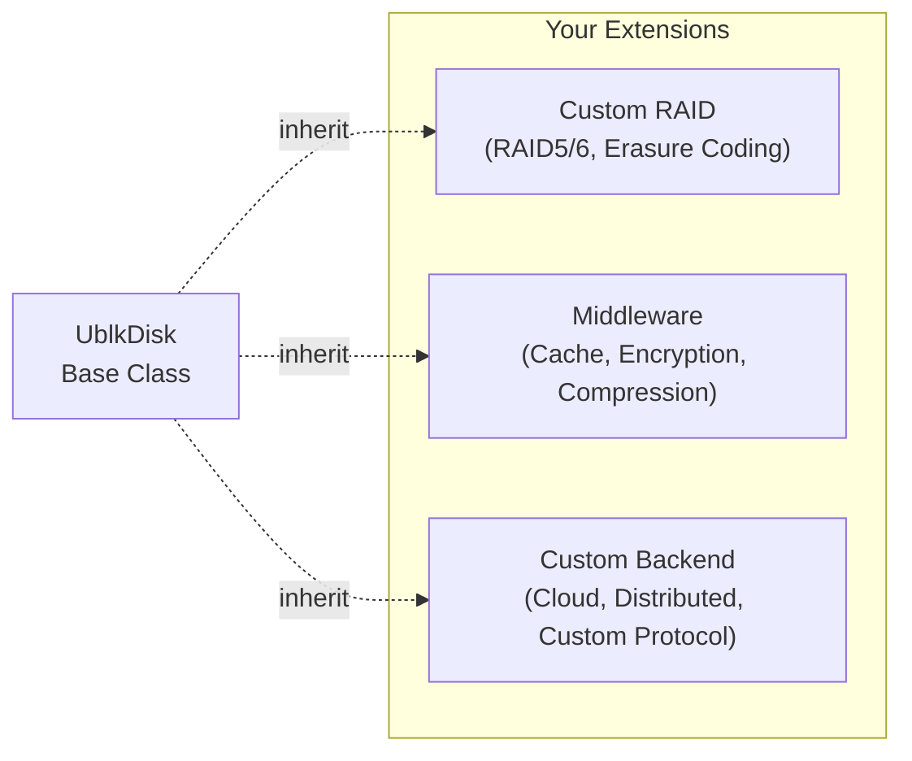
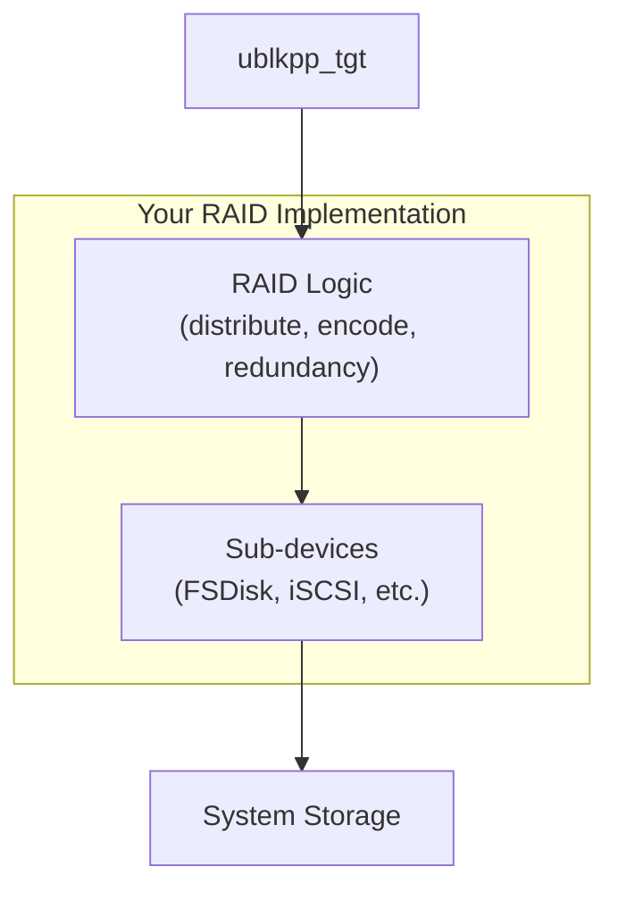

# Extending ublkpp

This guide shows how to extend ublkpp by creating custom UblkDisk drivers, implementing new RAID types, and building middleware layers.

## Overview

ublkpp's architecture is designed for composability:



**Extension Points:**
- **Backend Drivers**: Implement new storage backends (cloud, distributed systems, custom protocols)
- **RAID Types**: Create RAID5/6, erasure coding, or custom redundancy schemes
- **Middleware**: Add caching, encryption, compression, deduplication layers

## Implementing a Custom UblkDisk Driver

### Required Interface

Every UblkDisk must implement these pure virtual methods:

```cpp
class UblkDisk {
public:
    // Device properties
    virtual uint64_t capacity() const noexcept = 0;
    virtual std::string id() const noexcept = 0;

    // I/O operations
    virtual io_result async_iov(ublksrv_queue const* q,
                                ublk_io_data const* data,
                                sub_cmd_t sub_cmd,
                                iovec* iovecs,
                                uint32_t nr_vecs,
                                uint64_t addr) = 0;

    virtual io_result sync_iov(uint8_t op,
                               iovec* iovecs,
                               uint32_t nr_vecs,
                               off_t addr) noexcept = 0;

    // Command handlers
    virtual io_result handle_flush(ublksrv_queue const* q,
                                   ublk_io_data const* data,
                                   sub_cmd_t sub_cmd) = 0;

    virtual io_result handle_discard(ublksrv_queue const* q,
                                     ublk_io_data const* data,
                                     sub_cmd_t sub_cmd,
                                     uint32_t len,
                                     uint64_t addr) = 0;
};
```

### Optional Overrides

For advanced features, override these:

```cpp
// Device properties
virtual uint32_t block_size() const noexcept;      // Default: 4096
virtual uint32_t max_tx() const noexcept;          // Default: from params
virtual bool can_discard() const noexcept;         // Default: false

// Advanced I/O handling
virtual uint8_t route_size() const noexcept;       // Default: 0
virtual void collect_async(ublksrv_queue const*,
                           std::list<async_result>&); // Default: no-op
virtual void idle_transition(ublksrv_queue const*,
                             bool is_idle);          // Default: no-op
virtual void on_io_complete(ublk_io_data const*,
                            sub_cmd_t, int res);     // Default: no-op

// io_uring integration
virtual std::list<int> open_for_uring(int device);  // Default: empty
```

### Example: Simple RAM Disk

```cpp
#include <ublkpp/lib/ublk_disk.hpp>
#include <vector>
#include <cstring>

class RAMDisk : public ublkpp::UblkDisk {
    std::vector<uint8_t> _storage;
    uint64_t _capacity;
    std::string _id;

public:
    explicit RAMDisk(uint64_t size_bytes, std::string id = "ramdisk")
        : _storage(size_bytes, 0),
          _capacity(size_bytes),
          _id(std::move(id)) {
        // No direct_io for RAM (already in memory)
        direct_io = false;
    }

    // Device properties
    uint64_t capacity() const noexcept override {
        return _capacity;
    }

    std::string id() const noexcept override {
        return _id;
    }

    // Async I/O - for RAM, we complete synchronously
    io_result async_iov(ublksrv_queue const* q,
                        ublk_io_data const* data,
                        sub_cmd_t sub_cmd,
                        iovec* iovecs,
                        uint32_t nr_vecs,
                        uint64_t addr) override {
        // Determine operation from ublk_io_data
        auto op = ublksrv_queue_get_op(q, data);

        // RAM is fast - just do sync I/O
        auto res = sync_iov(op, iovecs, nr_vecs, addr);

        // Must complete to kernel for async path
        if (uses_ublk_iouring) {
            int result = res ? static_cast<int>(res.value()) : -res.error().value();
            ublksrv_complete_io(q, data, result);
        }

        return res;
    }

    // Sync I/O - actual RAM read/write
    io_result sync_iov(uint8_t op,
                       iovec* iovecs,
                       uint32_t nr_vecs,
                       off_t addr) noexcept override {
        // Validate bounds
        size_t total_len = 0;
        for (uint32_t i = 0; i < nr_vecs; ++i) {
            total_len += iovecs[i].iov_len;
        }

        if (addr + total_len > _capacity) {
            return std::unexpected(std::errc::invalid_argument);
        }

        // Perform I/O
        size_t offset = addr;
        for (uint32_t i = 0; i < nr_vecs; ++i) {
            auto* buf = static_cast<uint8_t*>(iovecs[i].iov_base);
            auto len = iovecs[i].iov_len;

            if (op == UBLK_IO_OP_READ) {
                std::memcpy(buf, _storage.data() + offset, len);
            } else if (op == UBLK_IO_OP_WRITE) {
                std::memcpy(_storage.data() + offset, buf, len);
            } else {
                return std::unexpected(std::errc::operation_not_supported);
            }

            offset += len;
        }

        return total_len;
    }

    // Flush - no-op for RAM
    io_result handle_flush(ublksrv_queue const*,
                          ublk_io_data const*,
                          sub_cmd_t) override {
        return 0;  // Success, nothing to flush
    }

    // Discard - zero out memory
    io_result handle_discard(ublksrv_queue const*,
                            ublk_io_data const*,
                            sub_cmd_t,
                            uint32_t len,
                            uint64_t addr) override {
        if (addr + len > _capacity) {
            return std::unexpected(std::errc::invalid_argument);
        }

        std::memset(_storage.data() + addr, 0, len);
        return len;
    }

    bool can_discard() const noexcept override {
        return true;  // Support TRIM/discard
    }
};
```

**Usage:**
```cpp
// Create 1 GiB RAM disk
auto ramdisk = std::make_shared<RAMDisk>(1 * ublkpp::Gi);

// Expose to kernel
auto uuid = boost::uuids::random_generator()();
auto tgt = ublkpp::ublkpp_tgt::run(uuid, ramdisk);

// Now accessible as /dev/ublkbN
```

### Example: Cloud Storage Backend

```cpp
class S3Disk : public ublkpp::UblkDisk {
    std::string _bucket;
    std::string _object_key;
    uint64_t _capacity;
    std::unique_ptr<S3Client> _client;

public:
    S3Disk(std::string bucket, std::string key, uint64_t size)
        : _bucket(std::move(bucket)),
          _object_key(std::move(key)),
          _capacity(size),
          _client(std::make_unique<S3Client>()) {
        direct_io = false;  // Cloud I/O handles its own buffering
    }

    uint64_t capacity() const noexcept override {
        return _capacity;
    }

    std::string id() const noexcept override {
        return fmt::format("s3://{}/{}", _bucket, _object_key);
    }

    // Implement async with S3 SDK async APIs
    io_result async_iov(ublksrv_queue const* q,
                        ublk_io_data const* data,
                        sub_cmd_t sub_cmd,
                        iovec* iovecs,
                        uint32_t nr_vecs,
                        uint64_t addr) override {
        auto op = ublksrv_queue_get_op(q, data);

        if (op == UBLK_IO_OP_READ) {
            // Async S3 GetObject with range
            auto range = fmt::format("bytes={}-{}", addr, addr + iov_len - 1);
            _client->GetObjectAsync(
                _bucket, _object_key, range,
                [this, q, data, iovecs](auto outcome) {
                    int result = handle_s3_response(outcome, iovecs);
                    ublksrv_complete_io(q, data, result);
                });
            return 0;  // Will complete asynchronously
        }

        // Similar for writes...
    }

    // Sync fallback
    io_result sync_iov(uint8_t op, iovec* iovecs,
                       uint32_t nr_vecs, off_t addr) noexcept override {
        // Implement blocking S3 calls
        // ...
    }

    // ... handle_flush, handle_discard, etc.
};
```

## Creating a RAID Type

### RAID Architecture Pattern

RAID devices compose other UblkDisks:



**Key Concepts:**
- RAID device owns or holds references to sub-devices
- I/O is distributed/duplicated across sub-devices
- Sub-command routing tracks which sub-device handles each I/O
- Error handling manages degraded states

### Example: RAID6 Skeleton

```cpp
#include <ublkpp/lib/ublk_disk.hpp>
#include <vector>

class Raid6Disk : public ublkpp::UblkDisk {
    std::vector<std::shared_ptr<ublkpp::UblkDisk>> _disks;
    uint32_t _stripe_size;
    uint64_t _capacity;

    // P and Q parity calculation helpers
    void calculate_parity(std::span<uint8_t*> data_chunks,
                         uint8_t* p_parity,
                         uint8_t* q_parity);

public:
    Raid6Disk(boost::uuids::uuid const& uuid,
              uint32_t stripe_size,
              std::vector<std::shared_ptr<ublkpp::UblkDisk>> disks)
        : _disks(std::move(disks)),
          _stripe_size(stripe_size) {

        if (_disks.size() < 4) {
            throw std::invalid_argument("RAID6 requires at least 4 disks");
        }

        // Capacity = (N - 2) * smallest_disk
        _capacity = (_disks.size() - 2) *
                    std::ranges::min(_disks | std::views::transform(
                        [](auto& d) { return d->capacity(); }));

        direct_io = true;
    }

    uint64_t capacity() const noexcept override {
        return _capacity;
    }

    std::string id() const noexcept override {
        return "RAID6";
    }

    // Route size for sub-device selection
    uint8_t route_size() const noexcept override {
        return ublkpp::ilog2(_disks.size());
    }

    io_result async_iov(ublksrv_queue const* q,
                        ublk_io_data const* data,
                        sub_cmd_t sub_cmd,
                        iovec* iovecs,
                        uint32_t nr_vecs,
                        uint64_t addr) override {
        auto op = ublksrv_queue_get_op(q, data);

        if (op == UBLK_IO_OP_READ) {
            return handle_read(q, data, sub_cmd, iovecs, nr_vecs, addr);
        } else if (op == UBLK_IO_OP_WRITE) {
            return handle_write(q, data, sub_cmd, iovecs, nr_vecs, addr);
        }

        return std::unexpected(std::errc::operation_not_supported);
    }

private:
    io_result handle_read(ublksrv_queue const* q,
                         ublk_io_data const* data,
                         sub_cmd_t sub_cmd,
                         iovec* iovecs,
                         uint32_t nr_vecs,
                         uint64_t addr) {
        // Calculate stripe mapping
        uint64_t stripe_num = addr / _stripe_size;
        uint32_t stripe_offset = addr % _stripe_size;

        // Determine data disks for this stripe
        uint32_t data_disks = _disks.size() - 2;
        uint32_t disk_idx = (stripe_num % data_disks);

        // Route to specific disk
        sub_cmd_t route = ublkpp::shift_route(sub_cmd, route_size()) | disk_idx;

        // Issue read to data disk
        return _disks[disk_idx]->async_iov(q, data, route, iovecs, nr_vecs,
                                           stripe_offset);
    }

    io_result handle_write(ublksrv_queue const* q,
                          ublk_io_data const* data,
                          sub_cmd_t sub_cmd,
                          iovec* iovecs,
                          uint32_t nr_vecs,
                          uint64_t addr) {
        // RAID6 write: read-modify-write
        // 1. Read old data + P + Q
        // 2. Calculate new P + Q
        // 3. Write data + P + Q

        // For simplicity, showing parallel write pattern
        uint64_t stripe_num = addr / _stripe_size;
        uint32_t data_disks = _disks.size() - 2;

        // Calculate parity (would need full stripe read first)
        std::vector<uint8_t> p_parity(_stripe_size);
        std::vector<uint8_t> q_parity(_stripe_size);

        // ... parity calculation ...

        // Issue writes to all affected disks (data + P + Q)
        // Use sub_cmd flags to track dependencies
        // ...

        return 0;  // Will complete async
    }

public:
    // Collect async results from sub-devices
    void collect_async(ublksrv_queue const* q,
                      std::list<ublkpp::async_result>& compl_list) override {
        for (auto& disk : _disks) {
            disk->collect_async(q, compl_list);
        }
    }

    // Sync I/O for internal operations
    io_result sync_iov(uint8_t op, iovec* iovecs,
                       uint32_t nr_vecs, off_t addr) noexcept override {
        // Similar logic to async, but blocking
        // ...
    }

    io_result handle_flush(ublksrv_queue const* q,
                          ublk_io_data const* data,
                          sub_cmd_t sub_cmd) override {
        // Flush all disks
        for (auto& disk : _disks) {
            auto res = disk->handle_flush(q, data, sub_cmd);
            if (!res) return res;
        }
        return 0;
    }

    io_result handle_discard(ublksrv_queue const* q,
                            ublk_io_data const* data,
                            sub_cmd_t sub_cmd,
                            uint32_t len,
                            uint64_t addr) override {
        // Discard on all data disks
        // ...
    }
};
```

## Advanced Topics

### Sub-command Routing Patterns

Sub-commands enable RAID to track which sub-device handles each I/O:

```cpp
// Example: RAID1 routing to replicas
class Raid1Disk : public ublkpp::UblkDisk {
    static constexpr uint8_t REPLICA_A = 0;
    static constexpr uint8_t REPLICA_B = 1;

    uint8_t route_size() const noexcept override {
        return 1;  // 1 bit = 2 replicas
    }

    io_result async_iov(...) {
        if (is_write) {
            // Write to both replicas
            auto route_a = set_route(sub_cmd, REPLICA_A);
            auto route_b = set_route(sub_cmd, REPLICA_B);

            // Mark second write as REPLICATE
            route_b = ublkpp::set_flags(route_b, ublkpp::sub_cmd_flags::REPLICATE);

            _device_a->async_iov(q, data, route_a, iovs, nr_vecs, addr);
            _device_b->async_iov(q, data, route_b, iovs, nr_vecs, addr);
        } else {
            // Read from primary
            auto route = set_route(sub_cmd, REPLICA_A);
            _device_a->async_iov(q, data, route, iovs, nr_vecs, addr);
        }
    }

    // Handle completion based on route
    io_result handle_internal(..., int res) override {
        uint8_t replica = extract_route(sub_cmd);

        if (replica == REPLICA_A && res < 0) {
            // Primary failed, retry on secondary
            RLOGW("Primary failed, trying secondary");
            return _device_b->async_iov(...);
        }

        return res;
    }
};
```

### Collect Async Pattern

For devices with async backends, collect completions:

```cpp
class MyRAID : public ublkpp::UblkDisk {
    std::vector<std::shared_ptr<ublkpp::UblkDisk>> _sub_devices;

    void collect_async(ublksrv_queue const* q,
                      std::list<ublkpp::async_result>& compl_list) override {
        // Collect from all sub-devices
        for (auto& dev : _sub_devices) {
            dev->collect_async(q, compl_list);
        }

        // Can also add device-specific completions
        // e.g., background operations
        if (_background_task_complete) {
            compl_list.push_back({
                .io = _background_io_data,
                .sub_cmd = ublkpp::set_flags(0, ublkpp::sub_cmd_flags::INTERNAL),
                .result = 0
            });
        }
    }
};
```

### Idle Transition Hooks

Detect when queues become idle for maintenance:

```cpp
class CacheDisk : public ublkpp::UblkDisk {
    bool _flush_pending{false};

    void idle_transition(ublksrv_queue const* q, bool is_idle) override {
        if (is_idle && _flush_pending) {
            // Queue is idle, safe to flush cache
            TLOGD("Queue {} idle, flushing cache", q->q_id);
            flush_cache();
            _flush_pending = false;
        }
    }

    io_result async_iov(...) {
        // Mark cache dirty
        _flush_pending = true;

        // Write to cache
        write_to_cache(iovecs, addr);

        // Will flush on idle
        return len;
    }
};
```

### Memory Estimation

Provide memory estimation for your devices:

```cpp
class Raid6Disk : public ublkpp::UblkDisk {
    static uint64_t estimate_device_overhead(
        uint32_t num_disks,
        uint64_t volume_size,
        uint32_t stripe_size) noexcept {

        // Superblock per disk
        uint64_t superblock_mem = num_disks * 4096;

        // Parity buffers (worst case: full stripe width)
        uint64_t parity_mem = 2 * stripe_size;  // P + Q

        // Reconstruction buffers
        uint64_t recon_mem = num_disks * stripe_size;

        return superblock_mem + parity_mem + recon_mem;
    }
};
```

## Metrics Integration

Add custom metrics to your devices:

```cpp
#include <sisl/metrics/metrics.hpp>

class MyDisk : public ublkpp::UblkDisk {
    sisl::Counter _cache_hits{"my_disk_cache_hits"};
    sisl::Counter _cache_misses{"my_disk_cache_misses"};
    sisl::Histogram _latency{"my_disk_latency_us", "Latency histogram"};

    void on_io_complete(ublk_io_data const* data,
                        sub_cmd_t sub_cmd,
                        int res) override {
        // Track metrics
        auto end = std::chrono::steady_clock::now();
        auto latency = std::chrono::duration_cast<std::chrono::microseconds>(
            end - _start_times[data]).count();

        HISTOGRAM_OBSERVE(_latency, latency);

        if (was_cache_hit(data)) {
            COUNTER_INCREMENT(_cache_hits, 1);
        } else {
            COUNTER_INCREMENT(_cache_misses, 1);
        }
    }
};
```

## Testing Custom Implementations

### Unit Testing with GMock

```cpp
#include <gtest/gtest.h>
#include <gmock/gmock.h>
#include "my_disk.hpp"

class MockBackend : public ublkpp::UblkDisk {
public:
    MOCK_METHOD(io_result, async_iov,
                (ublksrv_queue const*, ublk_io_data const*,
                 sub_cmd_t, iovec*, uint32_t, uint64_t), (override));
    MOCK_METHOD(io_result, sync_iov,
                (uint8_t, iovec*, uint32_t, off_t), (noexcept, override));
    // ... other mocks
};

TEST(MyDiskTest, HandlesReadCorrectly) {
    auto backend = std::make_shared<MockBackend>();

    EXPECT_CALL(*backend, async_iov(_, _, _, _, _, _))
        .WillOnce(Return(4096));  // Success

    auto my_disk = std::make_shared<MyDisk>(backend);

    iovec iov = {.iov_base = buffer, .iov_len = 4096};
    auto res = my_disk->async_iov(queue, data, 0, &iov, 1, 0);

    EXPECT_TRUE(res);
    EXPECT_EQ(res.value(), 4096);
}
```

### Integration Testing

```cpp
TEST(Raid6Test, SurvivesTwoDeviceFailures) {
    // Create RAID6 with 6 disks
    std::vector<std::shared_ptr<ublkpp::UblkDisk>> disks;
    for (int i = 0; i < 6; ++i) {
        disks.push_back(std::make_shared<ublkpp::FSDisk>(
            create_temp_file(1 * ublkpp::Gi)));
    }

    auto raid = std::make_shared<Raid6Disk>(uuid, 32 * ublkpp::Ki, disks);

    // Write data
    uint8_t write_buf[4096];
    fill_pattern(write_buf, 4096);
    iovec iov = {.iov_base = write_buf, .iov_len = 4096};

    auto res = raid->sync_iov(UBLK_IO_OP_WRITE, &iov, 1, 0);
    ASSERT_TRUE(res);

    // Fail two devices
    disks[0] = std::make_shared<ublkpp::DefunctDisk>();
    disks[1] = std::make_shared<ublkpp::DefunctDisk>();

    // Read should still work (reconstruct from parity)
    uint8_t read_buf[4096];
    iov.iov_base = read_buf;
    res = raid->sync_iov(UBLK_IO_OP_READ, &iov, 1, 0);

    ASSERT_TRUE(res);
    EXPECT_EQ(std::memcmp(write_buf, read_buf, 4096), 0);
}
```

## Best Practices

1. **Always validate inputs** in public methods (bounds, alignment, null checks)
2. **Use `std::expected` consistently** for error handling
3. **Log errors at the layer where detected** for debugging
4. **Respect alignment requirements** when `direct_io = true`
5. **Complete async I/O** with `ublksrv_complete_io()` when appropriate
6. **Test degraded states** thoroughly for RAID implementations
7. **Estimate memory usage** with static estimation functions
8. **Document sub-command routing** scheme for your device
9. **Handle INTERNAL and REPLICATE flags** correctly in error paths
10. **Use metrics** for observability in production

## Next Steps

- **[Library Guide](LIBRARY.md)**: Understand core concepts and architecture
- **[Integration Guide](INTEGRATION.md)**: Set up build environment
- **[API Reference](API.md)**: Detailed API documentation
- **[Example Code](../example/)**: Study `ublkpp_disk` implementation
- **[Existing RAID](../src/raid/)**: Review RAID0/1 implementations for patterns
