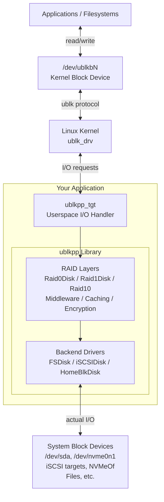

# ublkpp Library Guide

## Overview

ublkpp is a high-performance C++23 library that provides RAID support for Linux's userspace block (ublk) driver. It enables developers to create custom block devices in userspace with production-ready RAID implementations.

### What is ublkpp?

ublkpp bridges the gap between Linux kernel's ublk infrastructure and your application. It provides:

- **Abstraction Layer**: Clean C++ interfaces for implementing block devices
- **RAID Implementations**: Production-ready RAID0, RAID1, and RAID10
- **Backend Drivers**: File, iSCSI, and HomeBlocks support
- **Performance**: Zero-copy I/O paths using io_uring
- **Reliability**: Modern error handling with `std::expected`, comprehensive testing

### When to Use ublkpp

**Ideal Use Cases:**
- Building custom RAID configurations beyond standard mdadm capabilities
- Creating block device middleware layers (caching, compression, encryption)
- Implementing custom storage backends (cloud, distributed systems)
- Prototyping new RAID algorithms (RAID5/6, erasure coding)
- Developing storage appliances with userspace control

**Not Recommended For:**
- Simple file I/O (use standard filesystem APIs)
- Non-Linux platforms (ublk is Linux-specific, kernel 5.19+)
- Performance-critical kernel-space operations (consider kernel modules)

### Architecture Overview



**Key Components:**

- **Linux Kernel (`ublk_drv`)**: Kernel module that creates `/dev/ublkbN` block devices
- **Your Application**: Encapsulates the ublkpp library to provide custom storage logic
- **`ublkpp_tgt`**: Userspace target that handles I/O requests from kernel via ublk protocol
- **`UblkDisk` Stack**: Composable layers of RAID, middleware, and backend drivers
  - **RAID Layers**: `Raid0Disk`, `Raid1Disk` for software RAID implementations
  - **Backend Drivers**: `FSDisk`, `iSCSIDisk`, `HomeBlkDisk` that interact with system storage

**I/O Flow:**
1. Application reads/writes to `/dev/ublkbN`
2. Kernel `ublk_drv` forwards I/O to userspace `ublkpp_tgt`
3. `ublkpp_tgt` routes through UblkDisk stack (RAID layers, middleware)
4. Backend driver performs actual I/O to system devices (`/dev/sda`, iSCSI, files, etc.)
5. Completion flows back up the stack to kernel and application

## Core Concepts

### UblkDisk Abstraction

`UblkDisk` is the fundamental building block. All devices (backends, RAID layers, middleware) inherit from it:

```cpp
class UblkDisk {
public:
    // Device properties
    virtual uint64_t capacity() const noexcept = 0;
    virtual uint32_t block_size() const noexcept;
    virtual bool can_discard() const noexcept;

    // I/O operations
    virtual io_result async_iov(ublksrv_queue const* q,
                                ublk_io_data const* data,
                                sub_cmd_t sub_cmd,
                                iovec* iovecs,
                                uint32_t nr_vecs,
                                uint64_t addr) = 0;

    virtual io_result sync_iov(uint8_t op,
                               iovec* iovecs,
                               uint32_t nr_vecs,
                               off_t addr) noexcept = 0;

    // Command handlers
    virtual io_result handle_flush(...) = 0;
    virtual io_result handle_discard(...) = 0;
};
```

**Design Principles:**

- **Composability**: Stack devices like Lego blocks (RAID0 of FSDisk, RAID1 of iSCSI)
- **Polymorphism**: All devices share the same interface
- **Ownership**: Use `std::shared_ptr<UblkDisk>` for shared ownership
- **Type Safety**: Modern C++23 with concepts and constraints

### I/O Path and Flow

ublkpp supports two I/O modes:

#### Async I/O (Recommended)

Used by devices that leverage io_uring for zero-copy operations:

```cpp
io_result async_iov(ublksrv_queue const* q,
                    ublk_io_data const* data,
                    sub_cmd_t sub_cmd,
                    iovec* iovecs,
                    uint32_t nr_vecs,
                    uint64_t addr)
```

**Flow:**
1. Target receives I/O from kernel
2. Calls `UblkDisk::async_iov()`
3. Device submits to io_uring
4. Completion handled asynchronously via `collect_async()`
5. Target completes request back to kernel

**When to use:** FSDisk, custom drivers with async backends

#### Sync I/O

Used for synchronous operations or testing:

```cpp
io_result sync_iov(uint8_t op,
                   iovec* iovecs,
                   uint32_t nr_vecs,
                   off_t addr) noexcept
```

**When to use:** Simple backends, testing, internal operations

### Sub-command Routing

Sub-commands (`sub_cmd_t`) enable RAID layers to route I/O to multiple devices:

```cpp
using sub_cmd_t = uint16_t;

// Bits layout: [8 bits flags | 8 bits route]
// Flags: NONE, REPLICATE, RETRIED, DEPENDENT, INTERNAL
// Route: Device-specific routing (stripe index, replica ID)
```

**Key Concepts:**

- **Route bits**: Lower 8 bits for device-specific routing (e.g., RAID0 stripe index)
- **Flag bits**: Upper 8 bits for operation semantics
  - `REPLICATE`: Mirrored write (RAID1)
  - `INTERNAL`: Background operation (resync, bitmap updates)
  - `DEPENDENT`: Must succeed but doesn't affect user I/O result
  - `RETRIED`: Retry after failure

**Example:**
```cpp
// RAID0 distributes across stripes
uint8_t route_size() const noexcept override {
    return ilog2(_max_stripe_cnt); // 6 bits = 64 stripes
}

// RAID1 routes to primary/secondary replicas
sub_cmd_t route = is_write ? BOTH_REPLICAS : PRIMARY_REPLICA;
```

### Queue Management

Each ublk device has one or more I/O queues (default: 1):

```cpp
struct ublksrv_queue {
    int q_id;           // Queue identifier
    int q_depth;        // Queue depth (default: 128)
    // ... internal state
};
```

**Threading Model:**

- One thread per queue
- Queues are independent (lock-free between queues)
- Within a queue, operations are serialized
- Devices can track per-queue state if needed

**Queue Lifecycle Hooks:**

```cpp
// Called when queue transitions idle ↔ active
virtual void idle_transition(ublksrv_queue const* q, bool is_idle);

// Files to open for io_uring registration
virtual std::list<int> open_for_uring(int iouring_device);

// Collect completed async operations
virtual void collect_async(ublksrv_queue const* q,
                           std::list<async_result>& compl_list);
```

## Threading & Concurrency

### Thread Safety Guarantees

**Per-Queue Serialization:**
- All I/O for a queue is processed by a single thread
- No locks needed within a queue's execution path
- Devices can use per-queue state without synchronization

**Cross-Queue Concurrency:**
- Multiple queues may access device state concurrently
- Shared state requires synchronization (atomics, mutexes)
- RAID1 example: bitmap updates use atomic operations

**Implementation Pattern:**
```cpp
class MyDevice : public UblkDisk {
    // Per-queue state (no synchronization needed)
    struct QueueState {
        uint64_t io_count;
        // ...
    };
    std::vector<QueueState> _queue_state;

    // Shared state (requires synchronization)
    std::atomic<uint64_t> _total_io_count{0};
    std::mutex _metadata_lock;
};
```

### Lock-Free Patterns

ublkpp favors lock-free designs where possible:

**RAID1 Bitmap:**
```cpp
// Atomic chunk marking (lock-free)
std::atomic<uint32_t> _dirty_count;
void mark_dirty(uint64_t chunk_idx) {
    bitmap.set(chunk_idx);
    _dirty_count.fetch_add(1, std::memory_order_relaxed);
}
```

**Async Completion:**
```cpp
// Lock-free list for completed I/Os
std::list<async_result> results;
collect_async(q, results);  // Populated per-queue
```

## Memory Management

### Ownership Semantics

**Device Lifetime:**
```cpp
// Backends owned by RAID layers
auto disk_a = std::make_shared<FSDisk>("/dev/sda");
auto disk_b = std::make_shared<FSDisk>("/dev/sdb");

// RAID1 takes shared ownership
auto raid = std::make_shared<Raid1Disk>(uuid, disk_a, disk_b);

// Target takes shared ownership
auto tgt = ublkpp_tgt::run(uuid, raid);

// disk_a, disk_b lifetime managed by raid (shared_ptr)
```

**Buffer Ownership:**
- ublk driver owns I/O buffers
- Devices receive `iovec*` pointing to kernel-mapped memory
- Buffers valid only during I/O operation scope
- Do not store `iovec*` pointers across calls

### Direct I/O Requirements

Devices that use `O_DIRECT` must respect alignment:

```cpp
class FSDisk : public UblkDisk {
    FSDisk(path) {
        direct_io = true;  // Signal to target
        _fd = open(path, O_RDWR | O_DIRECT);
    }
};
```

**Alignment Rules:**
- Buffer addresses: aligned to `block_size()` (typically 4 KiB)
- I/O lengths: multiple of `block_size()`
- Offset addresses: multiple of `block_size()`

**RAID1 Enforcement:**
```cpp
// RAID1 requires direct_io from all layers
Raid1Disk::Raid1Disk(...) {
    direct_io = true;
    // Validates that device_a and device_b also have direct_io
}
```

### Buffer Alignment

ublk provides aligned buffers, but custom allocations need care:

```cpp
// Wrong: might not be aligned
char* buffer = new char[4096];

// Correct: use aligned allocation
void* buffer = aligned_alloc(4096, 4096);

// Or use io_uring provided buffers
// (already aligned by ublk)
```

## Error Handling Strategy

### std::expected Pattern

All I/O operations return `std::expected`:

```cpp
using io_result = std::expected<size_t, std::error_condition>;

io_result write_data(uint64_t addr, uint32_t len) {
    auto res = device->sync_iov(UBLK_IO_OP_WRITE, iov, 1, addr);
    if (!res) {
        DLOGE("Write failed at {:#x}: {}", addr, res.error().message());
        return res;  // Propagate error
    }
    return len;  // Success: return bytes written
}
```

**Checking Results:**
```cpp
// Check success
if (res) {
    size_t bytes = res.value();
}

// Check failure
if (!res) {
    std::error_condition ec = res.error();
    RLOGW("I/O error: {}", ec.message());
}

// Short-circuit pattern
auto res = do_io();
if (!res) return res;  // Propagate error
return process(res.value());
```

### Error Propagation

**Device Hierarchy:**
```
Raid1Disk::async_iov()
  └─> FSDisk::async_iov()
        └─> pwrite() → ENOSPC
```

**Propagation Flow:**
1. FSDisk: `pwrite()` fails → logs error → returns `std::unexpected(errno)`
2. Raid1Disk: receives error → marks device degraded → tries secondary replica
3. Target: receives final result → completes to kernel with status

**Best Practices:**
```cpp
io_result MyDevice::async_iov(...) {
    auto res = _backend->async_iov(...);
    if (!res) {
        // Log at the layer where error is detected
        DLOGE("Backend I/O failed: {}", res.error().message());

        // Can transform error if needed
        if (res.error() == std::errc::no_space_on_device) {
            _state = FULL;
            return std::unexpected(std::errc::device_or_resource_busy);
        }

        // Usually just propagate
        return res;
    }
    return res.value();
}
```

### Logging Integration (SISL)

ublkpp uses SISL logging with module-based filtering:

```cpp
// Logging levels
RLOGW("RAID degraded: {}", device_id);  // Warning
DLOGE("Write error at {:#x}: {}", addr, strerror(errno));  // Error with details
TLOGD("Resync progress: {}%", pct);  // Debug (trace)
LOGINFO("Device ready: {}", path);  // Info

// Modules (configured at runtime)
// - ublksrv: Target and ublk driver interface
// - ublk_tgt: Target implementation
// - ublk_raid: RAID0/1/10 implementations
// - ublk_drivers: FSDisk, iSCSI, HomeBlk backends
// - libiscsi: iSCSI protocol layer
```

**Configuration:**
```bash
# Set log level per module
export SISL_LOG_LEVEL="ublk_raid=debug,ublk_drivers=info"

# Or in code
sisl::logging::SetModuleLogLevel("ublk_raid", spdlog::level::debug);
```

## Metrics Framework

ublkpp provides opt-in metrics for monitoring:

### I/O Metrics

```cpp
class UblkIOMetrics {
    // Per-queue counters
    sisl::Counter _read_count;
    sisl::Counter _write_count;
    sisl::Histogram _read_latency;
    sisl::Histogram _write_latency;
};
```

**Automatic Collection:**
- Enabled by overriding `on_io_complete()`
- Called after every I/O operation
- Tracks latency, throughput, error rates

### Device-Specific Metrics

**FSDisk:**
```cpp
class UblkFSDiskMetrics {
    sisl::Counter _pread_count;
    sisl::Counter _pwrite_count;
    sisl::Counter _sync_count;
    sisl::Histogram _io_size;
};
```

**RAID1:**
```cpp
class UblkRaidMetrics {
    sisl::Counter _degraded_reads;
    sisl::Counter _resynced_chunks;
    sisl::Gauge _bitmap_dirty_pct;
    sisl::Counter _device_swaps;
};
```

### Custom Metrics

```cpp
class MyDevice : public UblkDisk {
    sisl::Counter _cache_hits;
    sisl::Counter _cache_misses;

    void on_io_complete(ublk_io_data const* data,
                        sub_cmd_t sub_cmd,
                        int res) override {
        if (cache_hit) {
            COUNTER_INCREMENT(_cache_hits, 1);
        } else {
            COUNTER_INCREMENT(_cache_misses, 1);
        }
    }
};
```

## Memory Estimation API

ublkpp provides APIs to estimate memory consumption before device creation:

### Target Queue Memory

```cpp
// Estimate per-target overhead (I/O queues, threads)
uint64_t queue_mem = ublkpp_tgt::estimate_queue_memory();
// Uses SISL options: nr_hw_queues, queue_depth, max_io_size
```

**Factors:**
- Number of queues (`nr_hw_queues`, default: 1)
- Queue depth (`qdepth`, default: 128)
- Max I/O size (`max_io_size`, default: 512 KiB)
- Buffer pools for io_uring

**Typical Values:**
- 1 queue, depth 128, 512 KiB I/O: ~70 MiB
- 4 queues, depth 256, 1 MiB I/O: ~1 GiB

### Device-Specific Memory

**RAID0:**
```cpp
// Superblock overhead only
uint64_t raid0_mem = Raid0Disk::estimate_device_overhead(
    num_disks  // Number of devices in stripe
);
// Typically: num_disks * 4 KiB (superblocks)
```

**RAID1:**
```cpp
// Superblocks + worst-case bitmap
uint64_t raid1_mem = Raid1Disk::estimate_device_overhead(
    volume_size  // Total volume size in bytes
);
// Example: 2 TiB volume → ~8 MiB (worst-case 100% dirty)
```

**Total Memory:**
```cpp
uint64_t total = ublkpp_tgt::estimate_queue_memory() +
                 Raid1Disk::estimate_device_overhead(2 * TiB);
// Example: ~78 MiB for 2 TiB RAID1 with default settings
```

## Performance Considerations

### Zero-Copy I/O

ublkpp uses io_uring for zero-copy I/O:

```cpp
// Target passes kernel buffers directly to device
virtual std::list<int> open_for_uring(int iouring_device) {
    return {_fd};  // Register file descriptor
}

// I/O uses registered FD (no buffer copies)
io_uring_prep_readv(sqe, _fd, iov, nr_vecs, offset);
```

### Async Path Optimization

Minimize latency in the async path:

```cpp
io_result async_iov(...) {
    // Bad: synchronous operation in async path
    auto metadata = read_metadata();  // Blocks!

    // Good: pre-load or defer
    if (_metadata_cached) {
        submit_io_uring(...);
        return 0;  // Will complete later
    } else {
        // Load async or fail fast
        return std::unexpected(std::errc::resource_unavailable_try_again);
    }
}
```

### Lock Contention

Avoid locks in hot paths:

```cpp
// Bad: lock per I/O
std::mutex _lock;
io_result async_iov(...) {
    std::lock_guard lg(_lock);  // Serializes all I/O!
    return submit(...);
}

// Good: per-queue state (lockless)
struct QueueState { ... };
std::vector<QueueState> _queue_state;  // Index by q->q_id
```

## Next Steps

- **[Integration Guide](INTEGRATION.md)**: Add ublkpp to your project
- **[Extension Guide](EXTENDING.md)**: Create custom RAID types and drivers
- **[API Reference](API.md)**: Detailed API documentation
