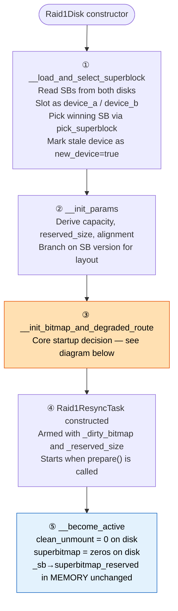
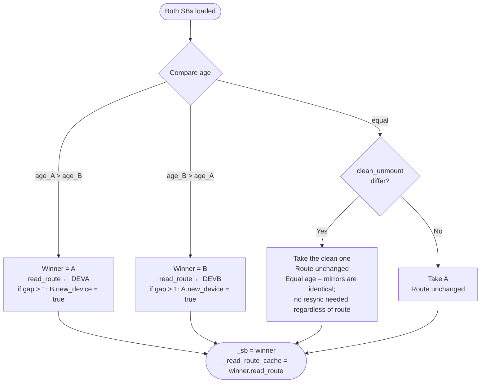
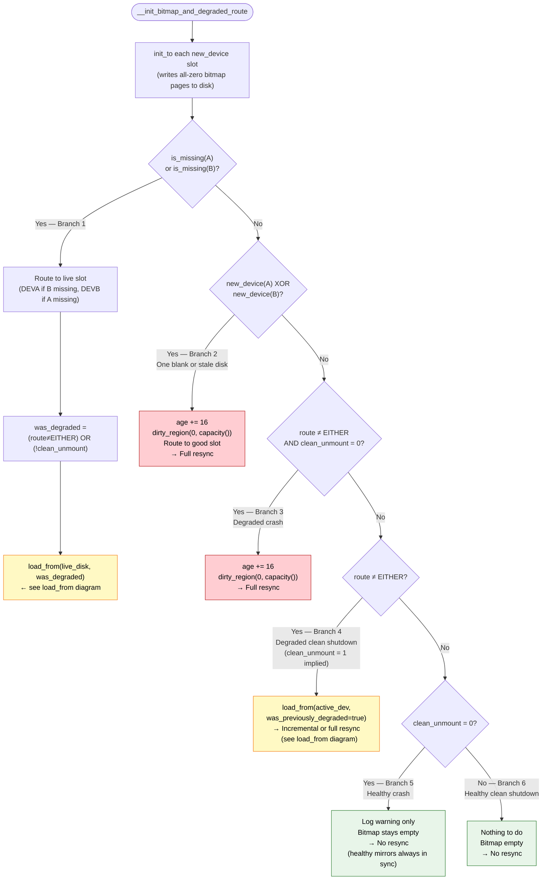
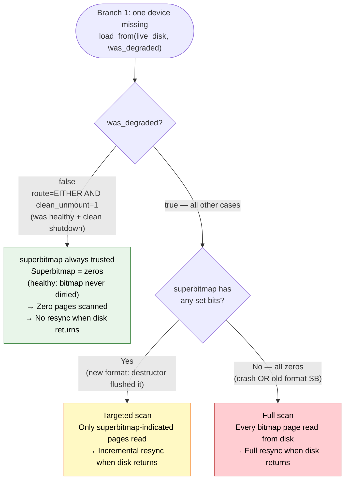
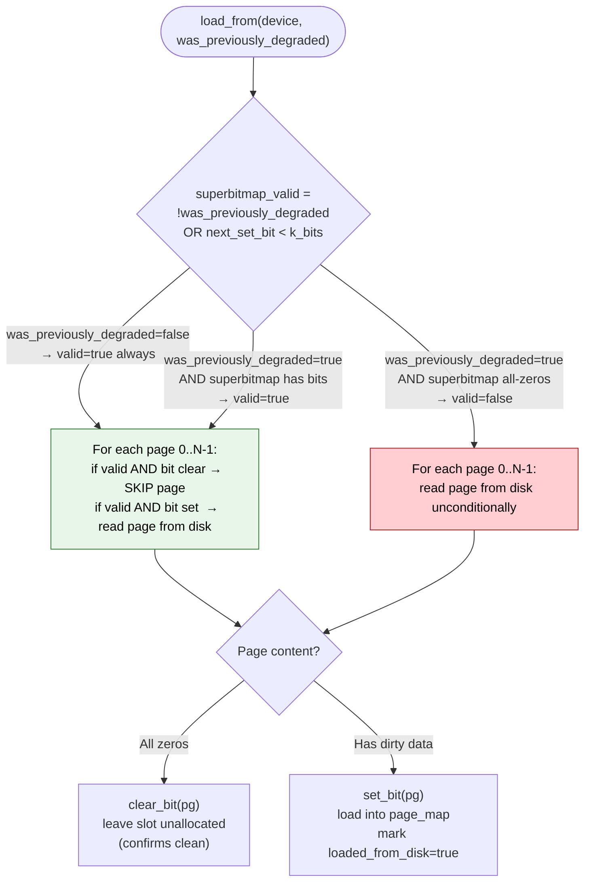
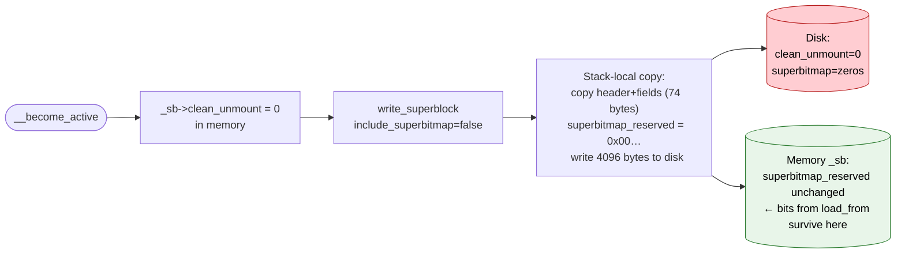
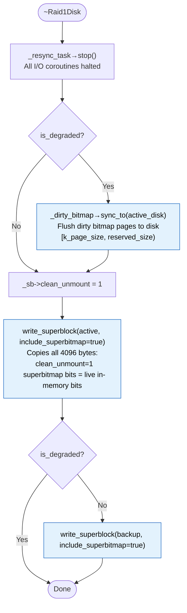
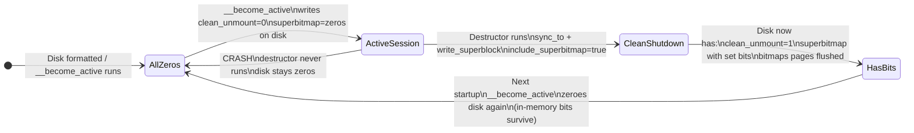
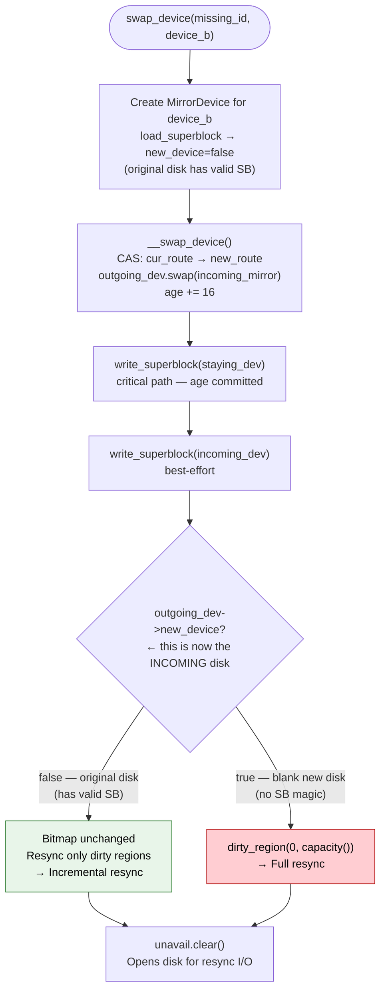
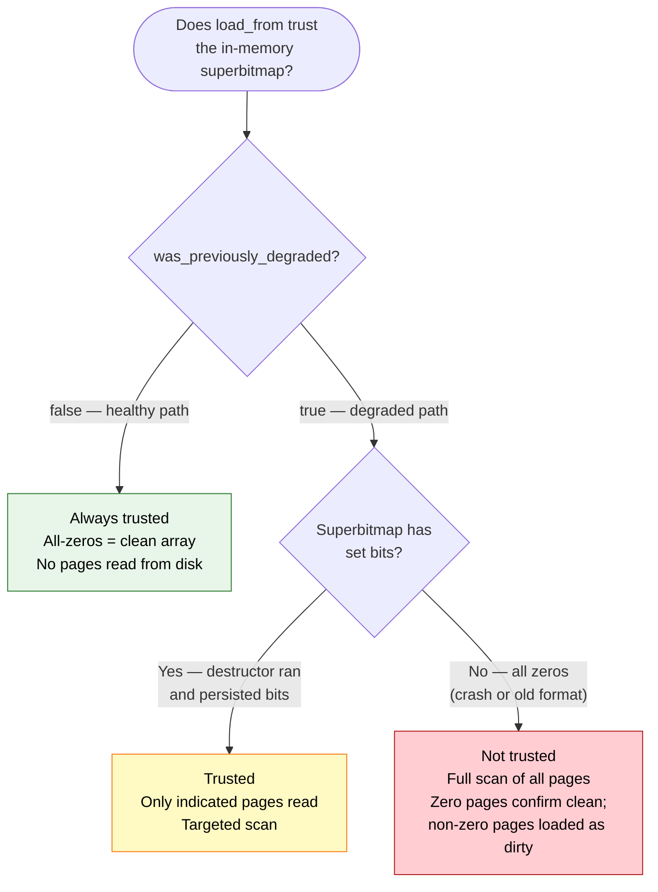

# RAID1 Startup Case Analysis

This document covers every startup scenario: which superblock is chosen, how the dirty
bitmap is loaded, when a full resync is forced, and when the superbitmap shortcut applies.

---

## Key Data Structures

### SuperBlock (4 KiB at offset 0 on each physical device)

```
 Byte 0                                                      Byte 4095
 ┌──────────────────────────────────────────────────────────────────┐
 │ header (34 B)                                                    │
 │   magic[16]  version[2]  uuid[16]                               │
 ├──────────────────────────────────────────────────────────────────┤
 │ fields (40 B)                                                    │
 │   clean_unmount:1  read_route:2  device_b:1                     │
 │   _reserved[16]  chunk_size[4]  age[8]                          │
 ├──────────────────────────────────────────────────────────────────┤
 │ superbitmap_reserved (4022 B = 32,176 bits)                      │
 │   bit N = 1 → bitmap page N has dirty chunks                    │
 │   bit N = 0 → page N clean (or not yet persisted)               │
 └──────────────────────────────────────────────────────────────────┘
 ↑ offset 0 (superblock)   ↑ offset 74 (superbitmap starts here)
```

| Field | Set by | Meaning |
|---|---|---|
| `clean_unmount` | `__become_active`→0, destructor→1 | 1 = clean shutdown, 0 = active or crashed |
| `read_route` | `__become_degraded`, `__become_clean`, `pick_superblock` | Which physical slot to route reads to |
| `age` | Every degradation (+1), every swap (+16), new array (+16) | Monotonic version; higher = more authoritative |
| `superbitmap_reserved` | destructor only (`include_superbitmap=true`) | Index into bitmap pages; persisted only on clean shutdown |

### Disk Layout

```
 offset 0           sizeof(SuperBlock)=4KiB     reserved_size (~125 MiB v2)   capacity
 ┌──────────┬────────────────────────────────────────────┬────────────────────────┐
 │SuperBlock│  Bitmap pages  (4 KiB each, 1 per GiB)    │    User data           │
 │  4 KiB   │  page 0 │ page 1 │ page 2 │ ...           │  (UBLK I/O target)     │
 └──────────┴────────────────────────────────────────────┴────────────────────────┘
             ↑ k_page_size                               ↑ _reserved_size
```

Each bitmap page covers 1 GiB of user data (with 32 KiB chunks, 4 KiB page = 4096×8 bits
= 32768 chunks × 32 KiB = 1 GiB). The superbitmap inside the SuperBlock is a one-bit index
over all bitmap pages — if bit N is set, page N must be read from disk; if clear, the page
is known clean and can be skipped.

---

## Startup Sequence



> **Critical invariant set by step ⑤**: `write_superblock` always copies to a stack-local
> buffer before writing. The in-memory `_sb->superbitmap_reserved` is **never** modified by
> `__become_active`. Bits loaded from disk in step ③ survive in memory even after the disk
> shows zeros. This is what makes the superbitmap useful at the *next* startup.

---

## Phase 1: Superblock Selection (`pick_superblock`)



**Age gap > 1** forces `new_device=true` on the lagging disk, bypassing incremental resync
and triggering a full copy at Branch 2 below. A gap of exactly 1 is allowed — it covers the
normal degradation event (+1) and means the lagging disk is only one step behind.

**Equal ages, asymmetric `clean_unmount`** means the clean-shutdown SB write succeeded on one
disk but not the other. Since ages are identical, both disks are bit-for-bit the same; no resync
is needed. The route field is left as-is from disk (not overridden here) — overriding it would
cause a spurious degraded-mode startup.

---

## Phase 2: Device Role Assignment

After `pick_superblock`, `_device_a` is normalized to the physical slot-A disk and `_device_b`
to slot-B using the `device_b` flag in the winning SB. This normalization ensures that
`read_route::DEVA` always means `_device_a` and `read_route::DEVB` always means `_device_b`.

---

## Phase 3: `__init_bitmap_and_degraded_route`

This is the heart of startup. All six branches are mutually exclusive (evaluated as `if / else if`).



### Branch 1 sub-cases: Missing device

`was_degraded = (route ≠ EITHER) OR (clean_unmount = 0)`



---

## `load_from` Logic: When Is the Superbitmap Trusted?



**Why zeros trigger full scan for degraded but not healthy:**

- **Healthy** (`was_previously_degraded=false`): healthy writes always hit both mirrors.
  The bitmap is never dirtied during healthy operation. All-zeros is always correct — trust it.
- **Degraded** (`was_previously_degraded=true`): all-zeros could mean (a) old-format superblock
  that predates superbitmap persistence, or (b) a crash that prevented the destructor from
  flushing. Both require a full scan. A new-format clean shutdown always has set bits if
  dirty pages existed.

---

## `__become_active`: What Hits Disk



This zeroing is the safety net: if the process crashes after `__become_active`, the next
startup sees all-zero superbitmap on disk and falls back to the safe path (full scan for
degraded, no scan needed for healthy).

---

## `~Raid1Disk`: What Gets Persisted on Clean Shutdown



After a clean shutdown the disk holds:
- **Bitmap pages**: all dirty chunks from the session flushed by `sync_to`.
- **Superbitmap**: one bit per dirty page — exact index for the next startup's targeted scan.
- **`clean_unmount` = 1**: signals to next startup that superbitmap is trustworthy.

---

## On-Disk Superbitmap Lifecycle



The cycle is: zeros → session (in-memory only) → crash (zeros remain) or clean shutdown
(bits written) → zeros again at next `__become_active`. The in-memory bits from `HasBits`
guide `load_from` between steps "HasBits" and "AllZeros".

---

## Returning Original Disk (`swap_device`)

Scenario: array runs degraded (B missing), writes happen (bitmap dirtied in memory and on
disk), the original disk B returns.



**Why age is NOT bumped in Branch 1 (missing device startup)**: bumping age at startup would
not prevent incremental resync — the returning disk's age would still only lag by 1 (≤ 1
threshold passes). Not bumping keeps the invariant simple and avoids an unnecessary age skip.
The +16 bump in Branch 2 and Branch 3 signals a forced-full-sync event that must be visible
as a large age gap to any future analysis.

---

## Complete Case Reference

| Scenario | route | clean_unmount | new_device | Branch | Bitmap action | Resync at startup |
|---|---|---|---|---|---|---|
| Both new (first start) | — | — | both=true | pre (init_to) | dirty all | Full |
| One blank, one existing | — | — | one=true | 2 | dirty all | Full |
| Age gap > 1 (declared stale) | — | — | stale=true | 2 | dirty all | Full |
| **Healthy clean shutdown** | EITHER | 1 | both=false | 6 | — | **None** |
| **Healthy crash** | EITHER | 0 | both=false | 5 | — | **None** |
| Degraded clean shutdown (new SB) | DEVA/B | 1 | both=false | 4 | load_from targeted | Incremental |
| Degraded clean shutdown (old SB) | DEVA/B | 1 | both=false | 4 | load_from full scan | Full |
| **Degraded crash** | DEVA/B | 0 | both=false | 3 | dirty all | **Full** |
| Missing: was healthy, clean | EITHER | 1 | live=false | 1 | load_from no scan | None (when B returns) |
| Missing: was healthy, crash | EITHER | 0 | live=false | 1 | load_from full scan | Full (when B returns) |
| Missing: was degraded, clean (new SB) | DEVA/B | 1 | live=false | 1 | load_from targeted | Incremental (when B returns) |
| Missing: was degraded, clean (old SB) | DEVA/B | 1 | live=false | 1 | load_from full scan | Full (when B returns) |
| Missing: was degraded, crash | DEVA/B | 0 | live=false | 1 | load_from full scan | Full (when B returns) |
| Original disk returns via swap_device | — | — | false | swap | bitmap unchanged | Incremental |
| Blank new disk via swap_device | — | — | true | swap | dirty all | Full |

> **"Resync at startup"** refers to resync that begins immediately once `prepare()` is called.
> For the "missing device" rows, the resync only begins when the missing disk is replaced
> via `swap_device`.

---

## Summary: When Is the Superbitmap Trusted?


